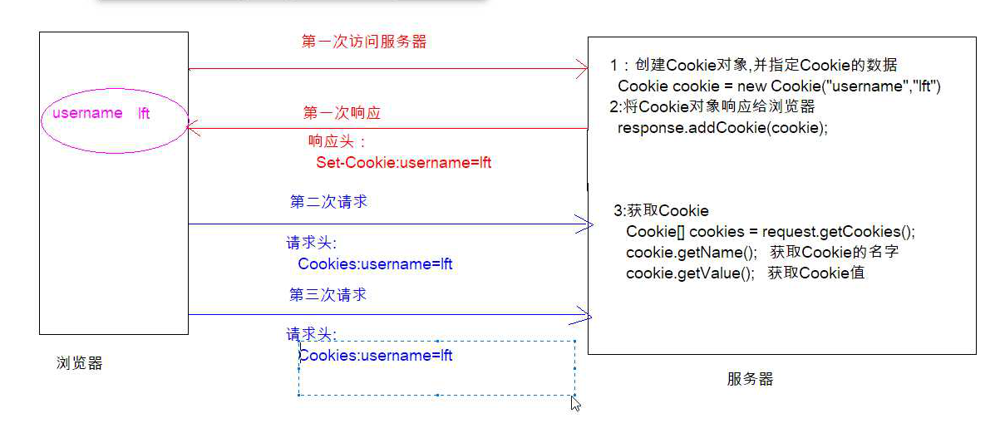

### 1. 会话

* 浏览器和服务器之间的连续发生的一系列请求和相应的过程
* 会话开始-->打开浏览器 访问京东
* 会话结束-->**关闭浏览器**(关闭京东页面不会结束)

* cookie和session是基于会话的
* session技术基于cookie技术

### 2. cookie

* 将数据存到浏览器的内存中

浏览器首次访问服务器,

1. 服务器**创建cookie**对象,并指定cookie数据

   ```java
   Cookie cookie = new Cookie("key","value");
   ```

2. 将Cookie对象响应给浏览器(cookie数据在响应头中)

   ```java
   response.addCookie(cookie);
   ```

浏览器再次访问(每一次访问都会携带已有cookie)

1. **获取Cookie**

   ```java
   Cookie[] cooikes = request.getCookies();
   // 获取Cookie的名字
   cookie.getName();
   // 获取cookie的值
   cookie.getValue();
   ```




方法

```java
// 设置cookie的存活时间(生命周期)
cookie.setMaxage(int sec) //参数是秒(int)
// cookie的默认生命周期为一次会话,关闭浏览器就消失,设置存活时间后,cookie存放在硬盘中

```

```java
// 设置cookie的访问路径
cookie.setPath(src);
	// 默认访问路径为项目下所有资源都携带
	// 设置成项目名/ 访问项目下的所有资源,请求都会携带cookie
cookie.setPath(request.getContextPath());
	// 设置成 项目名/文件夹a 访问项目中文件夹a下的所有资源都会携带cookie
cookie.setPath(request.getContextPath()+"/a");
	// 设置成 / -->访问服务器中的所有文件都会携带cookie
```

#### **清除cookie**

```java
Cookie cookie = new Cookie("需要清除键","");
cookie.setMaxAge(0) //将存活时间设置为0即是清除
cookie.setPath(/aba); // 清除cookie时,必须将就设置成创建时的路径.
```

#### cookie的缺点

> cookie的值不可以有空格
>
> 如果字符串有空格使用编码在解码即可避免
>
> ```java
> String data = "2018-12-23 12:35:36"
> Cookie cookie = new Cookie("data",URLEncoder.encode(date,"UTF-8")); //编码
> 
> // 解码
> URLDecoder.decode(date,"UTF-8")
> ```


### 3. session

* 将数据存到服务器(Tomcat)内存中

* 域对象  setAtrribute getAtrribute remove..

* 为了区分不同请求的session对象 对session对象进行编号 JSESSIONID,为了保存,服务器将session的id 以cookie的形式存到浏览器本地中.下次访问的时候,由于浏览器携带cookie,通过id的数据找到服务器的session

  * **创建session对象**

    `request.getSession();` 

    方法执行:

    1. 在服务器创建session对象

    2. 创建JSESSIONID

    3. 以响应cookie的形式给浏览器存放JSESSIONID

  * **向session存数据** 

    `session.setAttribute("键""值")`

    >  键类型为string 值为object

  * **获取session方法**

    `request.getSession()` 

    >  如果请求头中携带JSESSIONID 则是获取session
    >
    > 如果请求头中没有携带,则是创建session

  * **获取session数据 **

    `session.getAttribute("键")` 

* 如果需要长时间存储session 需要更改session的生命周期,同时也要更改cookie的的生命周期

  ```java
  // 更改session自动创建包含sessionID的cookie存活时间
  Cookie cookie = new cookie("JSESSIONID",session.getId());
  cookie.setMaxAge(Integer.MAX_VALUE);
  cookie.setPath(request.getContextPath());
  // 响应给浏览器
  response.addCookie(cookie);
  ```

清除session

```java
session.invalidate();
```

### 4. jsp

* jsp于html的区别
  * html只能写前端代码 html+css+js
  * jsp文件可以写 前端代码+java代码
* **jsp的本质是servlet**,访问后,会在硬盘中生成java文件和class文件

在jsp中写java

1. <%   java程序    % >   

   编译后,代码存放在service方法中,java代码中不能写方法-->java中 方法不能嵌套

2. <%!  java代码  %>

   编译后,代码会在成员位置,可以写方法

3. <%=java表达式或者是值%>

   等号后面为值,直接输出到页面上

   如果等号后面为变量,会报错.