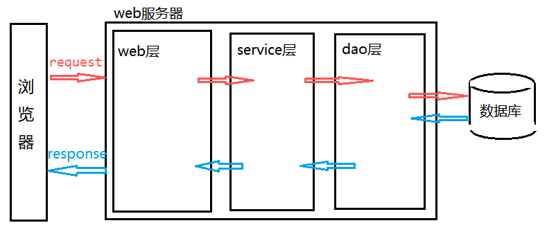

### 1. EL表达式

* 简化JSP中输出脚本的书写

  简化<%=从域中获取数据%>书写

* JSP的域对象

  | 类名               | 对象名      | 作用范围 |
  | ------------------ | ----------- | -------- |
  | HttpServletContext | application | 整个项目 |
  | HttpSession        | session     | 一次会话 |
  | HttpServletRequest | request     | 一次请求 |
  | HttpPageContext    | pageContext | 当前页面 |

  共有方法

  setAttribute(key,value)

  getAttribute(key)

  removeAttribute(key)

* 从四大域中取对象简化过程(以ServletContext为例,其余相同)

  1. 存数据

     ```jsp
     application.setAttribute("name1", "baoqiang1");
     ```

  2. 方式一 (完整版 ,找不到对应的键 返回null)

     ```jsp
     <%=application.getAttribute("name1")%>
     ```

  3. 方式二 (EL表达式 ,如果找不到对应的键,返回空串 )

     ```jsp
      ${applicationScope.name1}
     ```

  4. 方式三(找不到对应的键,返回空串,从范围最小的域向上找,找到一个不再向上找,所以要求键的名字不可以重复)

     ```jsp
     ${name1}
     ```

* 取javabean对象实例

  ```jsp
  <body>
       <%--向域中存储JavaBean对象--%>
      <%
          User user = new User("baoqiang",35,"male",new Birthday(1988,12,23));
          request.setAttribute("user", user);
      %>
      <%=((User)request.getAttribute("user")).getName()%>
      <%--使用EL表达式来简化,底层使用反射调用getName()方法--%>
      ${requestScope.user.name}
      ${user.name}
      ${requestScope.user.birthday.year}
      ${user.birthday.year}
  </body>
  ```

* 取集合对象

  ```jsp
   <%
          ArrayList<User> list = new ArrayList<User>();
          list.add(new User("baoqiang1",35,"male",new Birthday(1988,12,23)));
          list.add(new User("baoqiang2",35,"male",new Birthday(1989,12,23)));
          list.add(new User("baoqiang3",35,"male",new Birthday(1990,12,23)));
  
          request.setAttribute("key", list);
      %>
      <%--使用El来获取域中的数据--%>
      ${requestScope.key[0].name}
      <%=((ArrayList<User>)request.getAttribute("key")).get(0).getName()%>
      ${key[0].name}
      ${key[1].birthday.year}
  ```

* 取Map集合

  ```jsp
   <%
          Map<String, User> map= new HashMap<String, User>();
          map.put("u1", new User("baoqiang1",35,"male",new Birthday(1988,12,23)));
          map.put("u2", new User("baoqiang2",35,"male",new Birthday(1999,12,23)));
          map.put("u3", new User("baoqiang3",35,"male",new Birthday(1900,12,23)));
  
          request.setAttribute("map", map);
      %>
      <%--使用El来获取域中的数据--%>
      <%=(( Map<String, User>)request.getAttribute("map")).get("u1").getName()%>
      ${requestScope.map.u1.name}
      ${map.u1.name}
      ${map.u3.birthday.month}
  ```

* EL表达式运算符

  1. 算数运算符 +  -  * /  % 
  2. 逻辑运算符 &&  ||  ！ 
  3.  比较运算符 >  <  >= <=
  4. Null运算符 empty
  5.  三元运算符 `${str == null? "数据为空":str}`


* EL表达式使用的变量,必须放在域中

* empty关键字 

  * 空串和null都会输出空
  * 集合中没有数据则为空
  * javaBean对象 null为空

  ```jsp
  <%
  	String str = ""'
      request.setAttribute("str",a);
  %>
  ${empty str}
  -->输出true
  ```

### 2. jstl

* 简化<%逻辑代码%>书写

  #### 2.1 引入jstl 导入jar包

  导入`jstl.jar`  和 `standard.jar` 两个jar包

  ```jsp
  <%@ tablib uri="http://java.sun.com/jsp/jstl/cor" prefix="c"%>
  ```

  #### 2.2 常用的jstl标签  

  ##### 2.2.1 <c:if > 判断

  ```jsp
  test 测试条件成立
  var 用来保存条件的结果 true或者false
  scope 表示将结果存到那个域中
  <c:if test="${a > b}" var = "flag" scope = "session">  
      <h1> a > b 成立 </h1>
  </c:if>
  ```

  ##### 2.2.2 for 标签   <c:foreach >

  ```jsp
  for 标签
  1. 普通for
  	<c:foreach begin="0" end="5" var="i" step="1">
          <hi>hello${i}</hi>
  </c:foreach>
  
  begin 索引开始
  end 索引结束(包括结束值)
  var 循环变量 jsp会自动将该值存放在pageContext域中
  step 每一次循环的增量
  ```

  ```jsp
  2. 增强for
  <c:foreach items="${list}" var="str">
          ${str}
  </c:foreach>
  items="${list}" 从域中根据list这个键获取集合对象
  var="str" 每次循环时 jstl会自动将集合中的元素赋给str
  		  每次循环时，jstl会自动将str的值存入pageContext域
  arStatus="vs"  这个参数会记录当前循环的一些状态信息
                   vs.count  可以获取当前循环的次数
  ```

  获取循环次数实例

  ```jsp
  <c:forEach items="${list}" var="str" varStatus="vs">
              现在是第${vs.count}次循环<br/>
  </c:forEach>
  ```


#### 3. 三层架构与 MVC



* 3层架构
  * 表示层-->web层 与浏览器数据交互
  * 业务逻辑层 --> service层 处理业务逻辑
  * 数据访问层  -->dao层  与数据库进行数据交换
* MVC:   M-->moudel模型   V --> view 视图    C --> control 控制器

* **3层架构与mvc关系**

  **三层架构是整体的框架  MVC是web层的结构**


