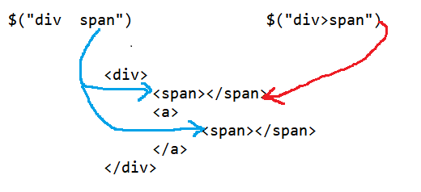

## jquery

### 1. jquery介绍

​	前端的三剑客: HTML CSS JS

* jquery是对js的封装
* jquery是为了简化js的书写
* jquery与js的关系,类似JDBC和DBUtils的关系
* jquery是第三方组织的js文件,使用需要引入
* jquery可以看作js的一个框架

**jquery引入**

```html
<script type="text/javascript" src="../js/jquery‐3.3.1.js"></script> 
```


### 2. js和jquery转换

使用js获取的对象称为js对象

* 将js对象转换为jquery对象  `$(js对象)` 

* 将jquery对象转换为js对象  `jquery对象[索引]` 

  * jquery对象的本质是一个数组

    jquery对象 = [js对象,js对象2 ....]


### 3. jquery绑定事件

```js
// js写法
window.onload = function(){ // js代码写在头部,需要写页面加载完成事件
     var btnIdEle =  document.getElementById("btnId");
     btnIdEle.onclick = function () {
          alert();
     }
}
// jquery写法
$(function(){  // jquery页面加载完成事件$()
    var btnIdEle = $("#btnId");
    btnIdEle.click(function(){
       alert("执行了") 
    });
})
```


### 4. jquery选择器

#### 4.1 基本选择器

| 选择器名称 | 语法          | 作用                 |
| ---------- | ------------- | -------------------- |
| 标签选择器 | $(" 标签名 ") | 获取指定标签名的元素 |
| id选择器   | $(" #id ")    | 获取指定id的元素     |
| 类选择器   | $(".类名")    | 获取指定类名的元素   |

#### 4.2 并列选择器 

* 基本选择器 逗号隔开,选择多个元素

  ```js
  //<input type="button" value=" 改变所有的<span>元素和 id 为 two 的元素的背景色为红色"  id="b4"/> 
  $("#b4").click(function(){
  	$("span,#two").css("backgroundColor","red"); 
  });
  ```


> $ 位置不同,作用不同
>
> 1. 页面加载事件
>
>    $(fuction(){ 
>
>    })
>
> 2. 选择器
>
>    $("#id")
>
> 3. 将js对象转换为jquery对象
>
>    $(js对象)

#### 4.3 层级选择器

| 选择器名   | 语法      | 作用                     |
| ---------- | --------- | ------------------------ |
| 后代选择器 | $("A  B") | 选择A元素内的所有B元素   |
| 子选择器   | $("A>B")  | 选择A元素下一层级B子元素 |




#### 4.4 属性选择器
| 选择器名       | 语法                                | 作用                       |
| -------------- | ----------------------------------- | -------------------------- |
| 属性选择器     | $("A[属性名]")                      | 包含指定属性的选择器       |
| 属性选择器     | $("A[属性名=值]")                   | 包含指定属性执行值的选择器 |
| 复合属性选择器 | `$("A[ 属性名=值 ][属性名 =值]...)` | 包含多个属性条件           |

实例:

```js
//<input type="button" value=" 含有属性title 的div元素背景色为红色"  id="b1"/> 
$("#b1").click(function(){
    $("div[title]").css("background‐color","red");
});   
//<input type="button" value=" 属性title值等于test的div元素背景色为红色"  id="b2"/> 
$("#b2").click(function(){
    $("div[title='test']").css("background‐color","red");
});  
//<input type="button" value="选取有属性id的div元素，然后在结果中选取属性title等于“test”的 div 元素 背景色为红色"  id="b3"/> 
$("#b3").click(function(){
    $("div[id][title='test']").css("background‐color","red");
})
```


#### 4.5 基本过滤选择器
| 选择器名       | 语法           | 作用                   |
| -------------- | -------------- | ---------------------- |
| 首元素选择器   | :first         | 获取选择元素的第一个   |
| 尾元素选择器   | :last          | 获得选择元素的最后一个 |
| 非元素选择器   | :not(selecter) | 不包含指定内容的元素   |
| 偶数选择器     | :even          | 偶数                   |
| 奇数选择器     | :odd           | 奇数                   |
| 大于索引选择器 | :gt(index)     | 大于指定索引           |
| 小于索引选择器 | :lt(index)     | 小于指定索引           |
| 等于索引选择器 | :eq(index)     | 等于指定索引           |
| 标题选择器     | :header        | 获取标题元素           |


#### 4.6 表单属性选择器

| 选择器名         | 语法      | 作用                |
| ---------------- | --------- | ------------------- |
| 可用元素         | :enabled  | 获取可用元素        |
| 不可用元素选择器 | :disabled | 获取不可用元素      |
| 选中选择器       | :checked  | 获取单选/复选框元素 |
| 选中选择器       | :selected | 获取下拉框元素      |

### 5. jquery 的DOM操作

#### 5.1 对文本和值的操作

| 方法名        | 解释                                        |
| ------------- | ------------------------------------------- |
| val( [value]) | 有参数为设置value属性 无参为获取value的值   |
| text([value]) | 有参数为设置文本内容 无参为获取文本内容     |
| html([value]) | 有参数为设置标签体内容 无参为获取标签体内容 |

#### 5.2 对属性操作
| 方法名             | 解释                                   |
| ------------------ | -------------------------------------- |
| attr(name,[value]) | 获取/设置属性的值                      |
| prop(name,[value]) | 获取设置属性的值(单选框 复选框 下拉框) |

#### 5.3 对class操作
| 方法名             | 解释                               |
| ------------------ | ---------------------------------- |
| css(name,[value])  | 获取/设置css样式                   |
| addClass(value)    | 增加类名                           |
| removClass(value)  | 删除指定的类样式                   |
| toggleClass(value) | 切换样式-如果有,删除,如果没有 添加 |

#### 5.4 插入对象
| 方法名           | 解释                      |
| ---------------- | ------------------------- |
| $("")            | 创建A元素对象             |
| append(element)  | 在最后添加元素 父子关系   |
| prepend(element) | 在最前面添加元素 父子关系 |
| before(element)  | 添加到当前元素前 兄弟关系 |
| after(element)   | 添加到当前元素后 兄弟关系 |

#### 5.5 删除对象
| 方法名   | 解释                     |
| -------- | ------------------------ |
| remove() | 删除指定元素             |
| empty()  | 清空指定元素的所有子元素 |

> html("") 也可以实现清空所有元素的效果