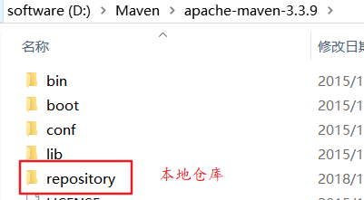
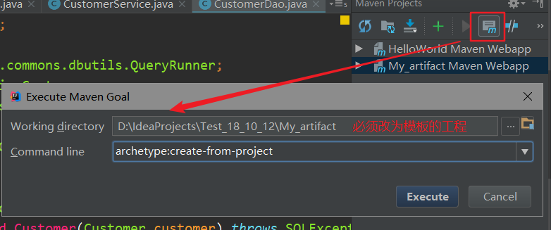
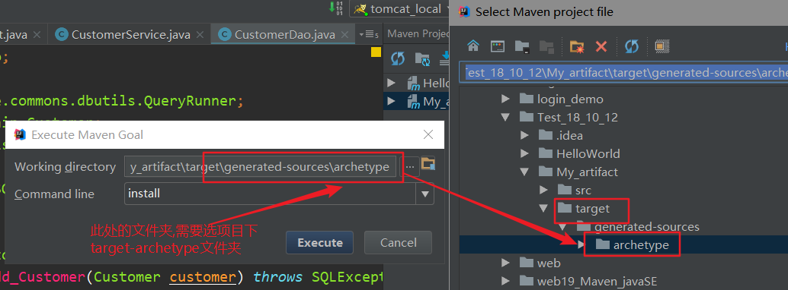

# Maven

## 1. 概念

* Maven是**项目管理工具**

* Maven的**作用**

  * 对Jar包进行管理,使用配置文件导入
  * 对项目初始化 编译 测试 报告 打包 部署 清理进行一条龙服务

* Maven的**仓库**

  仓库是存放项目使用的jar包和插件plugin的地方

  * 中央仓库: 存放常用jar包.远程服务器
  * 远程仓库(私服): 企业自己打包的核心jar包
  * 本地仓库: jar包和插件存储到本地

  > Maven寻找jar包的顺序是
  >
  > 本地仓库-->远程仓库-->中央仓库

* Maven的**坐标**

  * maven通过坐标定位仓库中的jar包

  * 坐标的组成

    1. **groupId**：     一般是公司域名的倒写： com.alibaba
    2. **artifactId**：   module项目的名字   :    day13_maven
    3. **version**：      版本 :    1.0.1-SNAPSHOT

  * 在maven中导入jar包,是在项目的pom.xml文件中添加依赖

    ```xml
     <dependency>  //依赖
    		<groupId>com.baotao</groupId>
    		<artifactId>verification</artifactId>
    		<version>1.0.0</version>
    		<scope>test</scope>  //表示jar包的作用范围
    </dependency>
    ```


## 2. Maven的安装和配置

1. 解压Maven压缩包
2. 解压本地仓库到Maven文件夹中



3. 配置本地仓库

   ```xml
   在解压目录下 ,设置：conf/settings.xml  本地仓库路径
   	   在55行：  <localRepository>D:\develop\apache-maven-3.5.2\repository</localRepository>
   
   ```

4. 配置远程仓库(阿里云)

   ```xml
    在159行的<mirrors><mirrors>标签中添加
   	   <mirror>
   	      <id>AliMaven</id>
   	      <name>aliyun maven</name>
   	      <url>http://maven.aliyun.com/nexus/content/groups/public/</url>
   	      <mirrorOf>central</mirrorOf>
          </mirror>
   ```

5. 设置Maven环境变量

   1. 设置MAVEN_HOME  就是你maven所在的路径
   2. 设置Path环境变量：`%MAVEN_HOME%\bin `

6. 测试
   ​          在打开DOS：mvn -v  可以出现版本信息     

##3. Maven的命令

Maven自带了一些对项目进行管理的命令:

* **clean**:   清除项目编译文件，    将项目下的target文件夹删除
* **compile**：对项目进行重新编译 ， 在项目下生成target文件夹
* **package**: 将当前的项目打成war/jar包target文件夹下,,最终可以将war包发布到Linux服务器上
* **install**: 将当前的项目发布到本地仓库
* **test**:    执行测试程序


## jar包的作用范围

| 定义                    | 范围           | 举例     |
| ----------------------- | -------------- | -------- |
| <scope>test</scope>     | 测试           | junit    |
| <scope>provided</scope> | 编译，测试     | servlet  |
| <scope>runtime</scope>  | 测试，运行     | jdbc驱动 |
| <scope>compile</scope>  | 编译 测试 运行 | （默认） |


### 5.自定义Maven骨架步骤

1. **在pom.xml中添加**

   ```xml
   <plugin>  
       <groupId>org.apache.maven.archetype</groupId>
       <artifactId>maven-archetype-plugin</artifactId>
       <version>3.0.0</version>
   </plugin>
   ```

2. **执行命令**

   `archetype:create-from-project`

   

3. **执行命令**

   `install`

    

4. **执行命令**

   `archetype:crawl`

   >  在任意文件夹下执行均可


### 解决Maven中文乱码问题

* 在pom.xml的插件中添加以下代码；

  ```xml
  <plugin>  
      <groupId>org.apache.maven.plugins</groupId>  
      <artifactId>maven-surefire-plugin</artifactId>  
      <version>2.16</version>  
      <configuration>  
      	<forkMode>once</forkMode>  
      	<argLine>-Dfile.encoding=UTF-8</argLine>  
      </configuration>  
  </plugin>  
  ```


