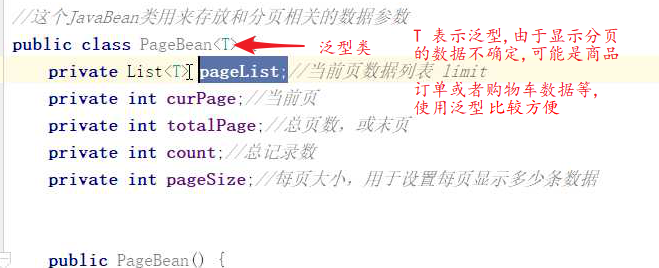

# 商城项目-2

1. 实现功能

   1. 导航栏

      

      * 页面加载完成后,发送请求向服务器索要导航数据
      * 数据存在mysql中,优化可以使用redis

   2. 热门商品展示

      1. 从数据库中选取9个热门商品显示到页面
      2. 最新商品

   3. 点击热门商品图片,出现商品详情页面

      1. 点击跳转,携带参数pid

   4. 分类页面的分页显示

      

