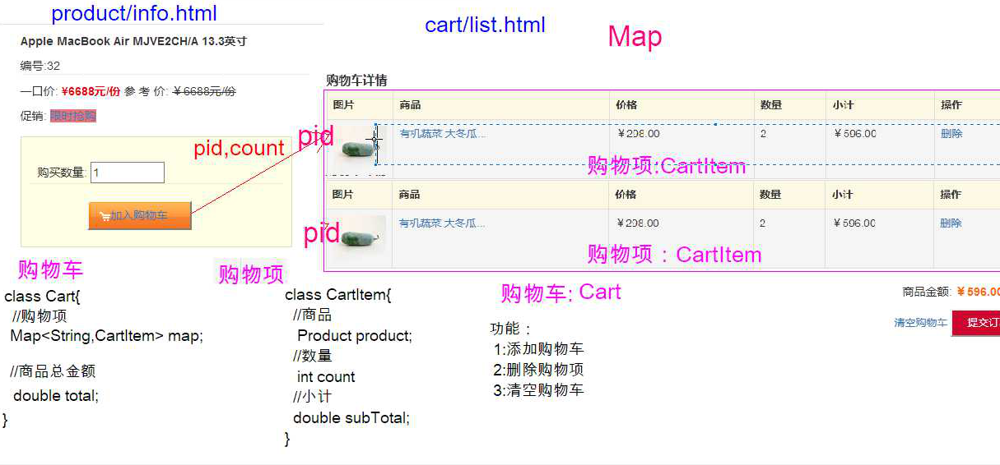

# 商城项目 -3

## 购物车

购物车的javabean 

购物项使用map集合

原因是,如果使用list,如果添加相同的商品 ,list集合是允许添加重复项目的.但是实际逻辑是添加相同的商品,不会出现新的项目,仅是修改数量即可.所以使用map集合,其键是商品的pid 值是购物项,map集合的键不可以重复,所以添加相同的商品,就可以修改数量即可

购物项的javabean中,小计只有get方法,没有set方法,原因是购物小计的金额是通过商品单价和数量计算出来,不需要赋值,只需要提供get方法即可.

订单提交==使用事务