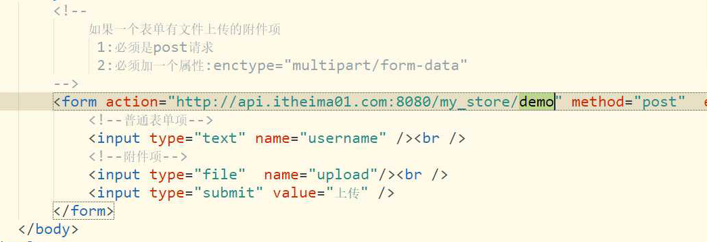

1. 添加商品中--获取分类列表

2. 上传文件-- 商品图片上传服务器

   1. 工具类

      Commons-IO

      用于文件和文件夹的复制和其他操作

   2. 如果一个表单有文件上传的附件项

      1. 必须是post请求
      2. 必须加上

      

面向接口编程

降低类之间耦合性

S s = new S(name) 

s.study()

Class clazz = S.clsss

clazz.getM